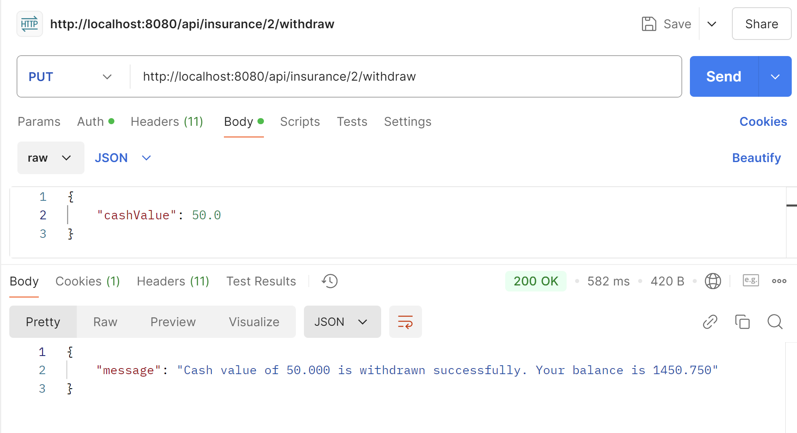

# Versicherungs-Simulator API
Die Versicherungs-Simulator API ist ein RESTful-Dienst, der für das Verwalten von Versicherungspolicen, Kunden und zugehörigen Transaktionen konzipiert ist. Diese API ermöglicht es, Versicherungspolicen zu erstellen, zu aktualisieren, abzurufen und zu löschen sowie Bargeldabhebungen und die Kundenverwaltung in einer strukturierten Weise zu handhaben. Die API verwendet strukturierte Antwortobjekte wie ApiResponse und CustomerListResponse, um konsistente und informative Antworten zu liefern.

## Inhaltsverzeichnis

- [Funktionen](#funktionen)
- [Verwendete Technologien](#verwendete-technologien)
- [Endpunkte](#endpunkte)
    - [Kundenverwaltung](#kundenverwaltung)
    - [Versicherungsverwaltung](#versicherungsverwaltung)
    - [Abhebungen](#abhebungen)
- [Tests Ausführen](#tests-ausführen)
- [Screenshots](#screenshots)


## Funktionen
**Kundenverwaltung:** Kunden erstellen, aktualisieren und löschen.<br />
**Versicherungsverwaltung:** Neue Versicherungen registrieren und Versicherungsdaten verwalten.<br />
**Transaktionsverarbeitung:** Sichere Verarbeitung und Nachverfolgung von Bargeldabhebungen.<br />
**Strukturierte Antworten:** Konsistente und strukturierte API-Antworten durch benutzerdefinierte Antwortobjekte.<br />

## Verwendete Technologien
- **Java 11** oder höher
- **Spring Boot** für die Erstellung von REST-APIs
- **Lombok** zur Reduzierung von Boilerplate-Code
- **Spring Security** für Benutzer-Authentifizierung und -Autorisierung
- **JUnit 5 und Mockito** für Tests

## Endpunkte
### Kundenverwaltung
**Kunden erstellen:** ```POST /api/customers``` <br />
**Alle Kunden abrufen:** ```GET /api/customers``` <br />
**Kunden aktualisieren:** ```PUT /api/customers/{customerId}``` <br />
**Kunden löschen:** ```DELETE /api/customers/{customerId}``` <br />

### Versicherungsverwaltung
**Versicherung registrieren:** ```POST /api/insurance``` 
**Alle Verträge abrufen:** ```GET /api/insurance```
**Kundenverträge abrufen:** ```GET /api/insurance/{customerId}```
**Kundenvertrag löschen:** ```DELETE /api/insurance/{insuranseId}```


### Abhebungen
- **Abhebung durchführen:** ```PUT /api/insurance/withdraw```
- Request Body:

```json
{
"insuranceId": 1,
"cashValue": 50.0
}
```


### Tests Ausführen
```bash
mvn test
```

### Screenshots

Einige Anwendungsbeispiele für die Nutzung der API.

_Die Erstellung eines Versicherungsvertrags:_


_Alle Verträge abrufen:_


_Erfolgreich Abhebung durchführen:_



_Unerfolgreich Abhebung durchführen:_


_Erfolgreich Vertrag löschen:_


_Unerfolgreich Vertrag löschen (Kein Vertag gefunden wird):_


_Zugriff verweigert-Verarbeitung:_

